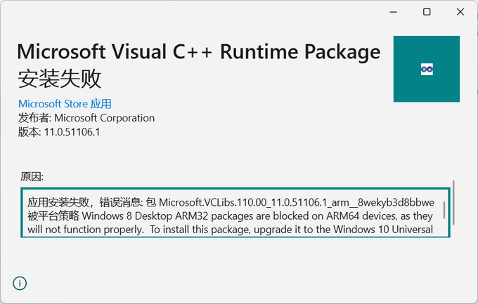
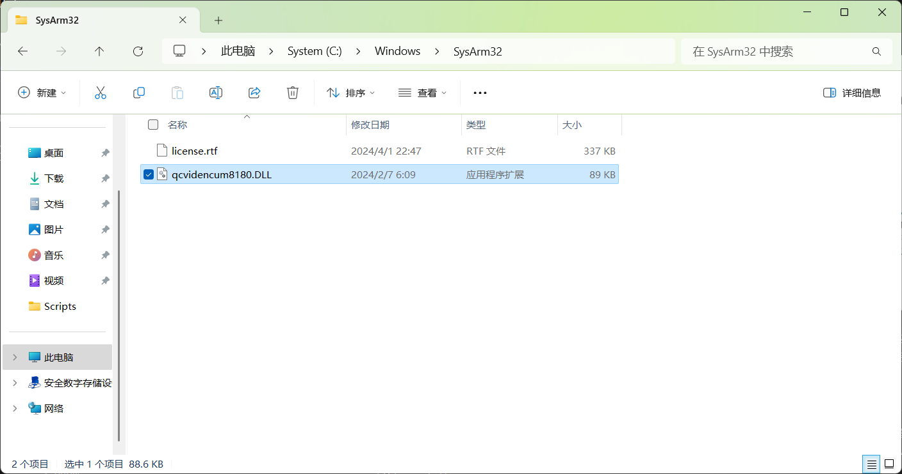
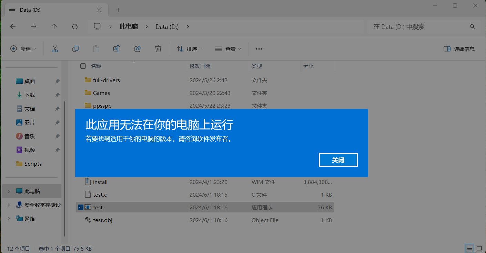

+++
title = 'ARM32 弃用，意味着什么'
date = 2024-06-01T17:50:29+08:00
categories = ['Windows', 'ARM64']
+++

震惊！Windows 要取消 32 位应用支持了！

确实这是标题党，但又不完全是：在 Windows 11 24H2 中，ARM32 应用支持将会被彻底移除。

那对于 ARM 设备用户，以及正在做 ARM 适配的开发者来说，这又意味着什么呢？

## Windows ARM32 是什么东西？

在 Windows NT 语境下，ARM32 （早期文档会直接称为 ARM）指自 Windows RT / Windows Phone 8.x 开始支持的 32 位 ARM 架构，使用 ARMv7 Thumb-2 指令集。

在 Windows 10/11 下，为了最大化利用 Windows Phone 遗产，并作为 ARM64 工具链成熟前的过渡方案，微软提供对 ARM32 应用的兼容，包括以下情况：

- ARM32 UWP 应用（不加判断地使用 Windows Mobile 扩展 API 的除外）

- ARM32 Win32 应用，且没有 Windows RT 臭名昭著的签名限制。Windows 10/11 可以直接运行早期为越狱 Windows RT 设备移植的 ARM32 桌面应用

但不包括：

- ARM32 .NET Framework （Windows RT 中自带）

- ARM32 Windows 8.x Metro App，试图安装 ARM32 Windows 8.x appx 包时会提示不兼容。

> 这是我最不解的，ARM32 最大的遗产就是 Windows RT 8.x 时代的 Xbox 游戏啊，这些反而不能安装是闹哪样啊

## 为什么要移除

如果你给 Apple Silicon 设备装过 Windows 11 虚拟机，估计已经知道为什么了：现在的 ARM SoC 已经去除 ARMv7 支持了。

下一代的高通骁龙 X 系列 SoC，也将彻底取消 ARMv7 支持。

ARM32 归根结底只是过渡方案，也始终没做成一个完善的生态。在 ARM64 已经成熟（甚至应用比 ARM32 丰富，连桌面版 QQ 都移植了）的今天，维持 ARM32 支持（即像某些 Android 设备一样加入 ARMv7 软件模拟器）实在没有必要。

## 被移除的到底是什么

我前几天给我的骁龙 8cx 笔记本重装了最新的 24H2 26100，以下是跟 ARM32 相关的变化：

- `C:\Windows\SysARM32` 下的 ARM32 系统库被完全移除，但驱动程序安装时请求写入到这个位置不会被拒绝（如此处的 `qcvidencum8180.dll` 是 GPU 驱动的解码器组件）。

- ARM32 WOW64 组件 `C:\Windows\System32\wowarmhw.dll` 也被删除了。

- 尝试运行 ARM32 EXE 会提示架构不兼容（如果你曾经用 Apple Silicon 设备安装过 Windows 11，应该会有印象）。 

- 26100 对应的 Windows SDK 也不再提供 ARM32 版本的库文件。

## 移除后要怎么办

如果你是最终用户，一般来说不会有什么影响：

- ARM32 UWP 应用一般都是从商店安装的，当你升级到 24H2 的时候，商店会试图下载应用的其他架构版本（x86/x64/ARM64）替换。当然从 ARM 原生替换为 x86 模拟的话，性能会有所下降。

- 如果你下载了一些 Windows RT 越狱移植的应用，这些开源软件（如 7-Zip、DOSBox-X 等）应该早就有 ARM64 移植了，而且一般版本更新，性能更高，直接替换即可。

对于开发者来说，那自然要移植到 ARM64 了，微软早已[发布文档](https://learn.microsoft.com/zh-cn/windows/arm/arm32-to-arm64)要求开发者迁移。

从 ARM32 迁移到 ARM64 相对来说是比较简单的（一般 32 到 64 位的迁移早已在 x86 到 x64 迁移的时候完成），但有几个特别要注意的点：

- UWP 虽然支持 ARM64，但只有 .NET Native，没有 JIT 运行时（一般称为 .NET CoreUWP）。这意味着哪怕是 Debug 模式也要做 AOT 编译才能运行/调试。微软目前的说法是，如果你需要快速开发，可以先编译成 x64……本人表示无语。如果实在受不了，就换 WinUI 3 吧。

- 如果需要检测当前系统支持的所有架构（比如输入法需要给每个架构都注册一次 TSF COM 组件），可以使用 [`IsWow64GuestMachineSupported`](https://learn.microsoft.com/zh-cn/windows/win32/api/wow64apiset/nf-wow64apiset-iswow64guestmachinesupported) API，它可以正确判断不兼容 ARM32 的情况。

如果是支持 ARM32 应用的 Windows 版本，两个都会返回 `TRUE`。

- 如果需要测试 ARM32 应用，可以在 Hyper-V 虚拟机上安装兼容 ARM32 的 Windows 版本，比如 Windows 11 23H2（22631）。ARM32 移除不影响虚拟机，当然前提是硬件本身支持 ARMv7 指令集。
