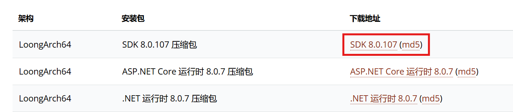
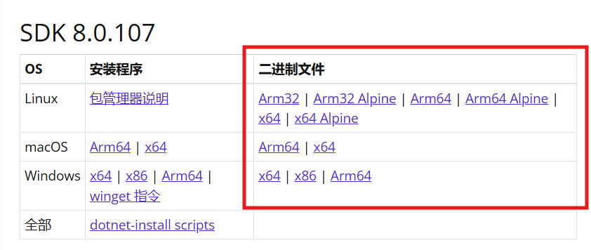

+++
title = '移花接木 —— 在其它平台上为 LoongArch 架构打包 .NET 程序'
date = 2024-10-27T03:41:25+08:00
categories = ['.NET', '龙芯', 'LoongArch']
+++

龙芯为 LoongArch 架构移植了 .NET 运行时，让 LoongArch 设备运行 .NET 程序成为了可能。

可惜由于 `linux-loongarch64` RID 属于社区支持状态，NuGet 上没有对应的运行时包。在其他平台上通过 `dotnet publish` 试图发布 `linux-loongarch64` 的包，会尝试从 NuGet.org 下载对应的运行时，然后失败。

而龙芯又恰好只发布了在 `linux-loongarch64` 上运行的 .NET SDK，这似乎就走到了死胡同。难道真的只能在 LoongArch 设备上才能为 `linux-loongarch64` 发布 .NET 应用？非也。

## 发布依赖框架，且不带 AppHost 的包

依赖框架很好理解，我们无法从 NuGet 获取 LoongArch 的 .NET 运行时，自然没法打出自包含的包。但 AppHost 指的是什么呢？

AppHost（运行时主机）是用来启动 .NET 运行时并调用托管程序入口点的原生程序。现代 .NET 程序打包出来的 Windows EXE / *nix ELF 可执行文件，实际上是 AppHost 的副本。

默认的 AppHost 是 C++ 编写的，它的架构也需要与目标设备一致。既然 LoongArch 的运行时包不能从 NuGet 获取，那自然 AppHost 也是获取不到的。

不使用 AppHost 发布也非常简单，只需加入 `-p:UseAppHost=false` 即可。

```shell
dotnet publish -r linux-loongarch64 -p:UseAppHost=false
```

如果应用没有其他原生（非托管）依赖，应该就可以正常发布了。你也可以考虑将目标 RID 改为 `linux` 甚至 `any`，使发布的包不带架构相关的特化逻辑。

## 将龙芯 .NET SDK 内置的运行时包提取到其它平台的 .NET SDK 上

但我们明白，`linux-loongarch64` 的运行时包是必然存在的，否则在 LoongArch 设备上也无法正常打包。那我们能不能将对应的运行时包提取出来呢？

答案是肯定的，而且其实非常简单。下面以旧世界（ABI1.0）的 .NET 8 与新世界（ABI2.0）的 .NET 9 RC 分别举例。

有关 LoongArch 的新旧世界问题，请参考 [咱龙了吗？](https://areweloongyet.com/) 网站的 [旧世界与新世界](https://areweloongyet.com/docs/old-and-new-worlds) 一文。

### 旧世界 .NET 8

- 旧世界的 .NET 由龙芯中科维护，可以从 https://www.loongnix.cn/zh/api/dotnet/ 获取，我们下载最新的 .NET 8 SDK 备用（本文编写时为 8.0.107）。\
下载得到 `dotnet-sdk-8.0.107-linux-loongarch64.tar.xz` 文件，解压到某个方便的地方，如 `dotnet-loong`。



> 注意：
>
> 该 tar 文件内部存在符号链接，请使用能正确处理符号链接的解压缩工具。\
> - 对于 Windows 来说，可以使用 7-zip，但请使用管理员权限运行 7-zip，以正确创建符号链接。\
> - 对于 Linux 来说，使用 tar -xf 即可。

- 根据你的编译机平台从微软官方下载同版本的 .NET SDK，注意要下载 “二进制文件” （即压缩包），而不是安装程序。\
这里以 Windows x64 举例，下载得到 `dotnet-sdk-8.0.107-win-x64.zip`，解压到某个方便的路径下，如 `dotnet-cross`。



- 将龙芯 .NET SDK 内 `dotnet-loong/packs` 下的以下目录复制到 `dotnet-cross/packs` 下。

```
Microsoft.AspNetCore.App.Runtime.linux-loongarch64
Microsoft.NETCore.App.Host.linux-loongarch64
Microsoft.NETCore.App.Runtime.linux-loongarch64
```

> 注意：
>
> 这三个目录下都有大量的符号链接，指向 `../shared/` 下的对应文件。\
> 为了避免符号链接映射出错，建议复制为真实文件。\
> - 对于 Windows 来说，直接使用资源管理器复制即可。\
> - 对于 Linux 来说，请给 cp 命令加 -L 参数，如 `cp -r -L Microsoft.AspNetCore.App.Runtime.linux-loongarch64 ~/dotnet-cross/packs`。

- 由于 .NET 8 上游并没有加入 `linux-loongarch64` 运行时包声明，所以需要补充。

打开 `dotnet-cross/sdk/8.0.107/Microsoft.NETCoreSdk/Microsoft.NETCoreSdk.BundledVersions.props`，分别搜索

```
RuntimePackNamePatterns="Microsoft.NETCore.App.Runtime.**RID**"
AppHostPackNamePattern="Microsoft.NETCore.App.Host.**RID**"
RuntimePackNamePatterns="Microsoft.AspNetCore.App.Runtime.**RID**"
```

找到其中 `TargetFramework="net8.0"` 的三项，并在其 `RuntimePackRuntimeIdentifiers` 中分别都加上 `linux-loongarch64`，如以下补丁：

```patch
diff --git a/sdk/8.0.107/Microsoft.NETCoreSdk.BundledVersions.props b/sdk/8.0.107/Microsoft.NETCoreSdk.BundledVersions.props
index d4a1785..db2e5e3 100644
--- a/sdk/8.0.107/Microsoft.NETCoreSdk.BundledVersions.props
+++ b/sdk/8.0.107/Microsoft.NETCoreSdk.BundledVersions.props
@@ -47,14 +47,14 @@ Copyright (c) .NET Foundation. All rights reserved.
                               TargetingPackName="Microsoft.NETCore.App.Ref"
                               TargetingPackVersion="8.0.7"
                               RuntimePackNamePatterns="Microsoft.NETCore.App.Runtime.**RID**"
-                              RuntimePackRuntimeIdentifiers="linux-arm;linux-arm64;linux-musl-arm64;linux-musl-x64;linux-x64;osx-x64;rhel.6-x64;tizen.4.0.0-armel;tizen.5.0.0-armel;win-arm64;win-x64;win-x86;linux-musl-arm;osx-arm64;linux-s390x;linux-bionic-arm;linux-bionic-arm64;linux-bionic-x64;linux-bionic-x86;linux-ppc64le"
+                              RuntimePackRuntimeIdentifiers="linux-arm;linux-arm64;linux-musl-arm64;linux-musl-x64;linux-x64;osx-x64;rhel.6-x64;tizen.4.0.0-armel;tizen.5.0.0-armel;win-arm64;win-x64;win-x86;linux-musl-arm;osx-arm64;linux-s390x;linux-bionic-arm;linux-bionic-arm64;linux-bionic-x64;linux-bionic-x86;linux-ppc64le;linux-loongarch64"
                               />
 
     <KnownAppHostPack Include="Microsoft.NETCore.App"
                       TargetFramework="net8.0"
                       AppHostPackNamePattern="Microsoft.NETCore.App.Host.**RID**"
                       AppHostPackVersion="8.0.7"
-                      AppHostRuntimeIdentifiers="linux-arm;linux-arm64;linux-musl-arm64;linux-musl-x64;linux-x64;osx-x64;rhel.6-x64;tizen.4.0.0-armel;tizen.5.0.0-armel;win-arm64;win-x64;win-x86;linux-musl-arm;osx-arm64;linux-s390x;linux-bionic-arm;linux-bionic-arm64;linux-bionic-x64;linux-bionic-x86;linux-ppc64le"
+                      AppHostRuntimeIdentifiers="linux-arm;linux-arm64;linux-musl-arm64;linux-musl-x64;linux-x64;osx-x64;rhel.6-x64;tizen.4.0.0-armel;tizen.5.0.0-armel;win-arm64;win-x64;win-x86;linux-musl-arm;osx-arm64;linux-s390x;linux-bionic-arm;linux-bionic-arm64;linux-bionic-x64;linux-bionic-x86;linux-ppc64le;linux-loongarch64"
                       ExcludedRuntimeIdentifiers="android"
                       />
 
@@ -144,7 +144,7 @@ Copyright (c) .NET Foundation. All rights reserved.
                               TargetingPackName="Microsoft.AspNetCore.App.Ref"
                               TargetingPackVersion="8.0.7"
                               RuntimePackNamePatterns="Microsoft.AspNetCore.App.Runtime.**RID**"
-                              RuntimePackRuntimeIdentifiers="win-x64;win-x86;win-arm;osx-x64;linux-musl-x64;linux-musl-arm64;linux-x64;linux-arm;linux-arm64;linux-musl-arm;win-arm64;osx-arm64;linux-s390x;linux-ppc64le"
+                              RuntimePackRuntimeIdentifiers="win-x64;win-x86;win-arm;osx-x64;linux-musl-x64;linux-musl-arm64;linux-x64;linux-arm;linux-arm64;linux-musl-arm;win-arm64;osx-arm64;linux-s390x;linux-ppc64le;linux-loongarch64"
                               RuntimePackExcludedRuntimeIdentifiers="android;linux-bionic"
                               />
 

```

- 此时使用 `dotnet-cross/dotnet` 就可以正常给 `linux-loongarch64` 发布应用了：

```
D:\Projects\website>\dotnet-cross\dotnet publish -r linux-loongarch64 --self-contained
适用于 .NET MSBuild 版本 17.8.5+b5265ef37
  Determining projects to restore...
  所有项目均是最新的，无法还原。
  website -> D:\Projects\website\bin\Release\net8.0\linux-loongarch64\website.dll
  website -> D:\Projects\website\bin\Release\net8.0\linux-loongarch64\publish\

D:\Projects\website>cd bin\Release\net8.0\linux-loongarch64\publish\

D:\Projects\website\bin\Release\net8.0\linux-loongarch64\publish>bash.exe -c "file website"
website: ELF 64-bit LSB shared object, LoongArch, version 1 (SYSV), dynamically linked, interpreter /lib64/ld.so.1, for GNU/Linux 4.15.0, BuildID[sha1]=848e004cb2e21eed5a39efadde2114eebd74fb04, stripped

D:\Projects\website\bin\Release\net8.0\linux-loongarch64\publish>
```

### 新世界 .NET 9

新世界 .NET 9 由 loongson-community 维护，目前版本是 .NET 9 RC1。可以在 https://github.com/loongson-community/dotnet-unofficial-build/releases 下载。

提取过程与 .NET 8 基本相当，但 .NET 9 已经加入了对应的运行时包声明，无需修改 `Microsoft.NETCoreSdk.BundledVersions.props`。

```
D:\Projects\website>\dotnet-9-cross\dotnet publish -r linux-loongarch64 --self-contained
还原完成(2.5 秒)
你正在使用 .NET 的预览版。请参阅 https://aka.ms/dotnet-support-policy
  website 已成功 (16.2 秒) → bin\Release\net9.0\linux-loongarch64\publish\

在 20.7 秒内生成 已成功

D:\Projects\website>cd bin\Release\net9.0\linux-loongarch64\publish

D:\Projects\website\bin\Release\net9.0\linux-loongarch64\publish>bash.exe -c "file website"
website: ELF 64-bit LSB pie executable, LoongArch, version 1 (SYSV), dynamically linked, interpreter /lib64/ld-linux-loongarch-lp64d.so.1, for GNU/Linux 5.19.0, BuildID[sha1]=a100ffc1b282ee2e02a9e2ed2e142737b9fa9ea7, with debug_info, not stripped

D:\Projects\website\bin\Release\net9.0\linux-loongarch64\publish>
```