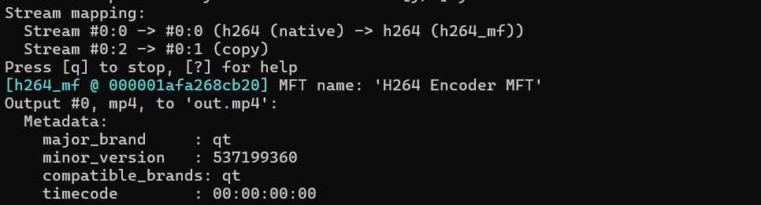
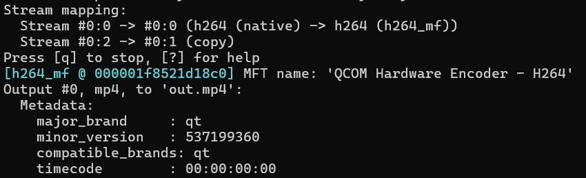
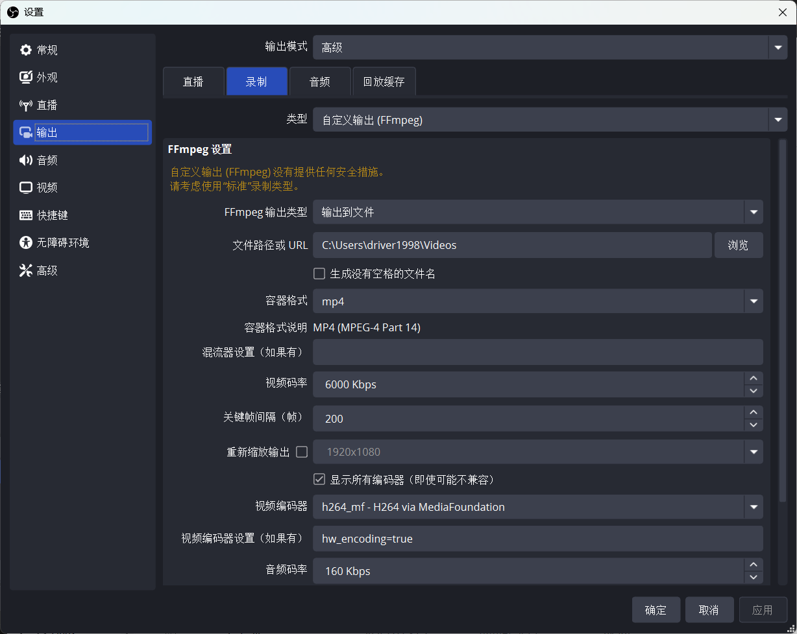
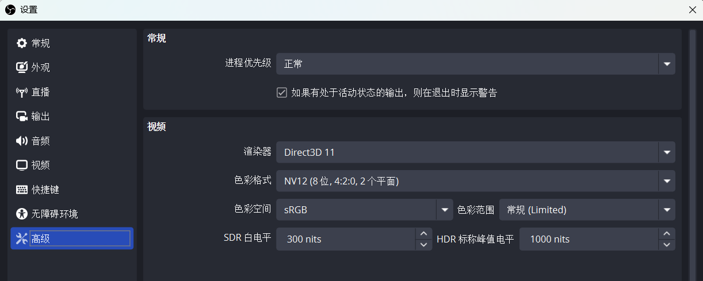
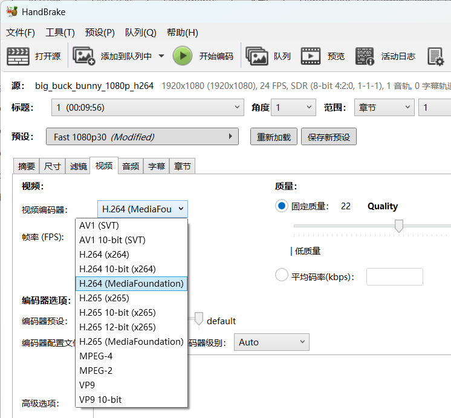

+++
title = '在高通 Windows 设备上调用硬件视频编码'
date = 2025-04-23T00:14:00+08:00
categories = ['Windows', 'ARM64', 'FFmpeg']
+++

高通 Windows ARM64 平台，如骁龙 8cx 和骁龙 X Elite 等，只提供了基于 Media Foundation 的硬件编码器，并没有提供更底层的硬件编码 API，像 Intel 的 QSV、AMD 的 AMF 以及 NVIDIA 的 NVENC 等。那么，我们到底应该怎么调用高通的硬件编码器呢？

这里以 FFmpeg 命令行、OBS Studio 以及 Handbrake 为例介绍如何使用。

## FFmpeg 命令行

早在 2020 年，Martin Storsjö 就将 Media Foundation wrapper [传入 FFmpeg 上游](https://www.mail-archive.com/ffmpeg-devel@ffmpeg.org/msg102273.html)， 如今主流版本的 FFmpeg 都应该支持使用 Media Foundation 编码器。

在 FFmpeg 中，使用 Media Foundation 的编码器分别为 `h264_mf` 和 `hevc_mf`，可惜当你直接使用时，会发现调用的是 `H264 Encoder MFT` 和 `HEVCVideoExtensionEncoder`，这是系统（以及 HEVC 视频扩展）所带的软件编码器。



要使用高通的硬件编码器，需要满足两点：

- 像素格式为 `nv12` (`-pix_fmt nv12`)
- 额外设置 `hw_encoding` 参数为 `true`

示例如下：
```shell
FFmpeg -i input.mov -c:v h264_mf -c:a copy -pix_fmt nv12 -hw_encoding true out.mp4
```

此时日志中会显示使用的是 `QCOM Hardware Encoder - H264` 或 `QCOM Hardware Encoder - HEVC`，即高通的硬件编码器。



最新的骁龙 X 系列支持 AV1 硬件编码，但 FFmpeg 暂未支持 Media Foundation 上的 AV1 编码器，所以目前无法通过 FFmpeg 调用。

## OBS Studio

OBS Studio 的 Windows ARM64 支持已经基本完成，目前可以从其 [GitHub Actions](https://github.com/obsproject/obs-studio/actions/workflows/scheduled.yaml) 中下载到每日构建的测试版本。

要在 OBS Studio 中使用高通的硬件编码，暂时需要以下配置：

- 设置-输出，输出模式选择“高级”，然后在“录制”页面，类型选择“自定义输出(FFmpeg)”
- 容器格式选择 `mp4`/`mkv`/`mov` 等视频容器
- 视频编码器选择 `h264_mf` 或 `hevc_mf`
- 视频编码器设置填入 `hw_encoding=true`

如下图所示：



然后在 设置-高级 下，确定色彩格式为 NV12：



确定后即可在录制时使用高通的硬件编码。只可惜由于使用自定义输出，这个配置无法作用于直播。

高通的工程师正在[给 OBS Studio 添加原生的 Media Foundation 编码支持](https://github.com/obsproject/obs-studio/pull/11993)，可以持续关注。

## Handbrake

Handbrake 的 Windows ARM 支持已经发布有一段日子了，可以直接在 [GitHub Releases](https://github.com/HandBrake/HandBrake/releases) 上下载。

Handbrake 已经对高通的硬件编码器做了支持，只需要确定选择的是 Media Foundation 编码器，即可调用硬件编码，其它设置可以保持默认。


