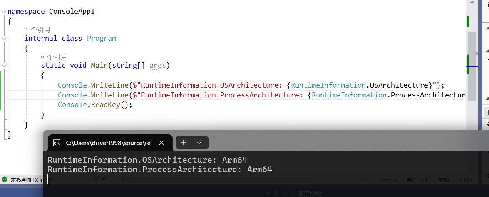
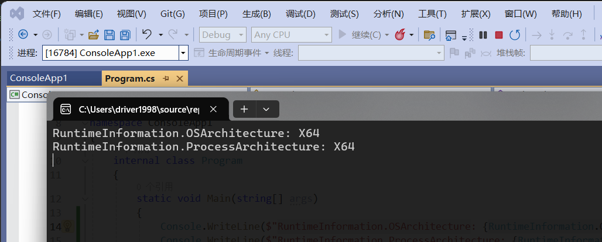
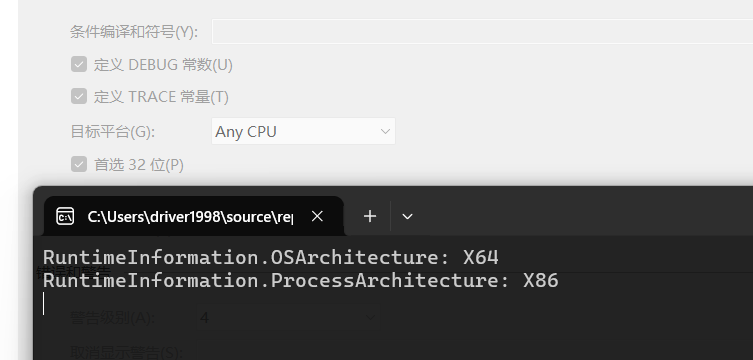
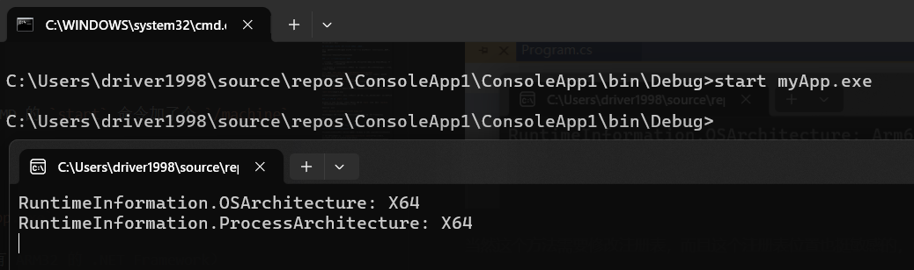
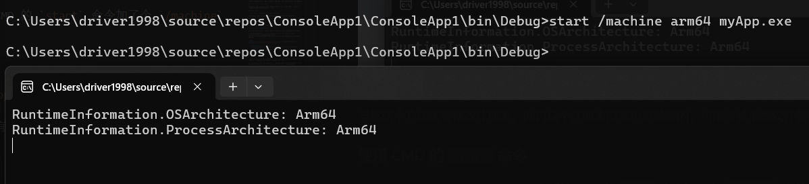
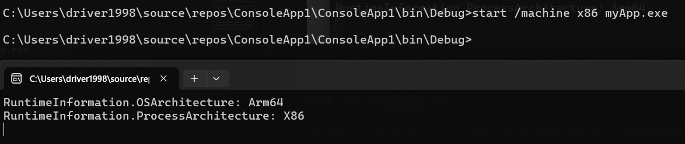
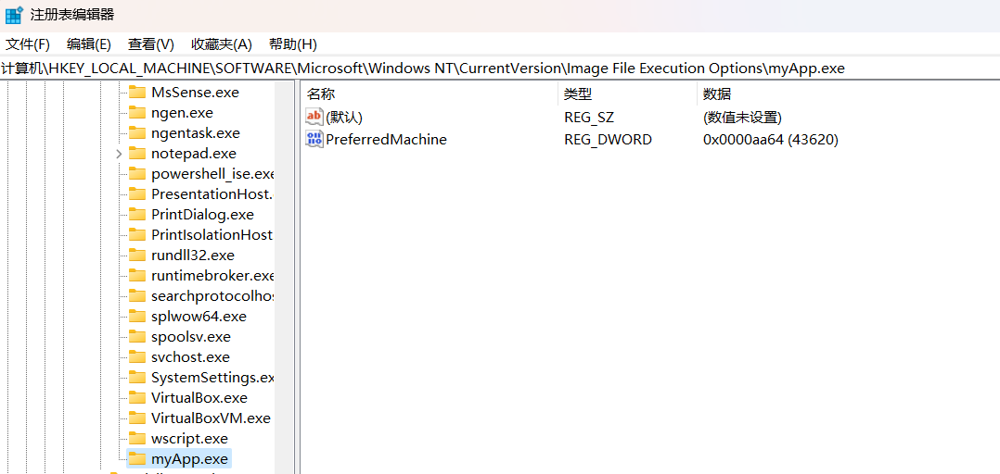
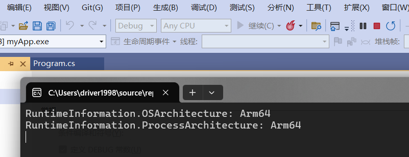

+++
title = '.NET Framework 应用在 Windows ARM64 上的化学反应'
date = 2024-05-23T00:22:48+08:00
categories = ['Windows', 'ARM64', '.NET']
+++

在微软一再拒绝移植之后 ~~（过时技术警告）~~，.NET Framework 4.8.1 终于提供了官方的原生 ARM64 支持。

虽然这早就不是新闻了（自带 .NET Framework 4.8.1 的 Win11 22H2 Nickel 22621 都出来两年了，基于 .NET Framework 的 VS2022 ARM 版本也早已可用），但还是有必要提一些细节问题的。

## No luck for you, Windows 10

首先是系统支持问题，.NET Framework ARM64 版本仅支持 Windows 11（22000+）。

微软虽然为 Windows 10 提供了升级包，但该升级包只升级系统自带的 32 位 x86 .NET Framework，不会安装原生版本。

这里希望使用 ARM 设备的用户尽可能升级到 Windows 11。原生 .NET Framework 和 x64 应用模拟支持都能极大提高 ARM 设备的可用性，真的没有太大的必要留在 Windows 10。

## 如何判断当前架构

因为 .NET 有 AnyCPU 构建方式，在运行时判断当前系统和进程的架构就变得很重要。

如果应用目标是 .NET Framework 4.7.1 或以上，直接读取 [`RuntimeInformation.OSArchitecture`](https://learn.microsoft.com/zh-cn/dotnet/api/system.runtime.interopservices.runtimeinformation.osarchitecture?view=netframework-4.8.1) 和 [`RuntimeInformation.ProcessArchitecture`](https://learn.microsoft.com/zh-cn/dotnet/api/system.runtime.interopservices.runtimeinformation.processarchitecture?view=netframework-4.8.1) 即可。



当然你也可以 P/Invoke 对应的 Windows API，如 [`IsWow64Process2`](https://learn.microsoft.com/zh-cn/windows/win32/api/wow64apiset/nf-wow64apiset-iswow64process2)、[`GetProcessInformation`](https://learn.microsoft.com/zh-cn/windows/win32/api/processthreadsapi/nf-processthreadsapi-getprocessinformation) 等。

> 要注意 x64 进程在 ARM64 下虽然是模拟运行，但不在 WOW64 容器内，所以 `IsWow64Process2` 的
`pProcessMachine` 会返回 `NULL` （与 ARM64 系统下运行 ARM64 进程一致）。\
> 要区分两者，请使用 `GetProcessInformation` 并传入 `ProcessInformationClass = ProcessMachineTypeInfo`，它可以准确判断进程是 x64 还是 ARM64。

然后你就会发现...

## AnyCPU 是你的谎言

AnyCPU 最初的设计确实是让 .NET 应用能在各种不同的 CPU 架构和环境（x86/IA64/ARM，32/64 位）下都能原生运行，ARM64 上它们理应能直接变成原生 ARM 应用。

可惜由于十几年间 .NET Framework 有实用价值的只有 x86/x64 两个架构，大部分标称 AnyCPU 的应用遇到 64 位环境会假定为 x64 并加载 x64 的原生依赖。

为了保持兼容性，微软只好在 ARM64 上一刀切，将 AnyCPU 程序全部强制以 x64 模拟的方式运行（另外注意到 `OSArchitecture` 也会返回 `X64`，估计也是兼容性考量）。



如果你的程序声明了 32 位优先，则默认以 32 位 x86 运行。



PS: 有人可能会好奇 32 位的 ARM，Windows 10/11 不支持 ARM32 的 .NET Framework，虽然它确实存在过。

PS2: 如果你不需要 AnyCPU 带来的便利，直接将构建目标改成 ARM64 即可免去所有烦恼，目标框架为 .NET Framework 4.0 以上的应用都可以添加 ARM64 构建目标，不需要更新到 4.8.1。

## 怎么让你的 AnyCPU .NET 应用以 ARM64 原生运行

微软一刀切之后，怎么让你的 AnyCPU 程序继续能 AnyCPU，在所有机器上都能原生运行呢？

很可惜，目前并没有十分完美的方案。

### 使用 CMD 的 `start` 命令

Windows 11 22H2 (Nickel, 22621) 之后给 CMD 的 `start` 命令加了个 `/machine` 参数，可以很方便地以某种架构启动进程。

语法非常简单：

`start /machine x86|amd64|arm|arm64 myApp.exe`

（当然你指定 ARM 程序是跑不起来的，系统没有 ARM32 的 .NET Framework）

如图所示：







这个方法很方便，但问题也挺多：

- 只有 CMD 有，Powershell 好像没类似的功能。

- 你得专门写个启动程序的脚本，而且还要解决 CMD 要弹控制台窗口的问题。

- 只有 22H2 之后才有这个参数，初始版本 21H2 (22000) 没有。

### 给 `CreateProcessEx` 加参数指定目标架构

还有没有更给力的方法？起码不用弹控制台？

[`CreateProcessEx`](https://learn.microsoft.com/zh-cn/windows/win32/api/processthreadsapi/nf-processthreadsapi-createprocessa) 的 `lpProcessAttributes` 中加了一个新的条目 `PROC_THREAD_ATTRIBUTE_MACHINE_TYPE`，可以指定启动进程的架构。

下面是一段示例代码：

```c
// SPDX-License-Identifier: MIT
#define _WIN32_WINNT 0x0A00      // _WIN32_WINNT_WIN10
#define NTDDI_VERSION 0x0A00000B // NTDDI_WIN10_CO

#include <assert.h>
#include <stdlib.h>
#include <string.h>
#include <windows.h>

int main(void) {
  char cmdLine[32767];

  const char *app = "myApp.exe";
  memcpy(cmdLine, app, strlen(app) + 1);

  STARTUPINFOEX si = {0};
  si.StartupInfo.cb = sizeof(STARTUPINFOEX);

  BOOL bRet;
  size_t attrListSize = 0;
  InitializeProcThreadAttributeList(NULL, 1, 0, &attrListSize);
  assert(attrListSize > 0);

  si.lpAttributeList = malloc(attrListSize);
  bRet = InitializeProcThreadAttributeList(si.lpAttributeList, 1, 0,
                                           &attrListSize);
  assert(bRet);

  // 指定进程启动的架构
  WORD processMachineType = IMAGE_FILE_MACHINE_ARM64;
  bRet = UpdateProcThreadAttribute(
      si.lpAttributeList, 0, PROC_THREAD_ATTRIBUTE_MACHINE_TYPE,
      (void *)&processMachineType, sizeof(processMachineType), NULL, NULL);
  assert(bRet);

  PROCESS_INFORMATION pi = {0};
  bRet = CreateProcess(NULL, cmdLine, NULL, NULL, FALSE,
                       EXTENDED_STARTUPINFO_PRESENT | CREATE_NEW_CONSOLE,
                       NULL, NULL, (STARTUPINFO *)&si, &pi);
  assert(bRet);

  DeleteProcThreadAttributeList(si.lpAttributeList);
  free(si.lpAttributeList);

  CloseHandle(pi.hProcess);
  CloseHandle(pi.hThread);

  return 0;
}
```

问题也很明显，你要写这么大一坨代码。

### 使用映像劫持强制指定目标架构

还有没有更给力的方法？

映像劫持对一些人来说应该不陌生，即在运行某个名字或路径的 exe 时强制重定向为另一个 exe，还有一些别的功能。

而在 Windows 11 里，相同的注册表键下加了一个新的注册表值，可以强制指定执行程序使用的目标架构。

在注册表的 `HKEY_LOCAL_MACHINE\SOFTWARE\Microsoft\Windows NT\CurrentVersion\Image File Execution Options` 下面创建一个名字为 AnyCPU EXE 文件名的键，如 `myApp.exe`。

然后在其中创建 DWORD 值 `PreferredMachine`，值即为目标架构的编码：x64 为 `0x8664`，ARM64 为 `0xAA64`。（没错，应该是故意凑的）



此时我们的 `myApp.exe` 就会以 ARM64 运行了（如果不能，请去掉 32 位优先选项）。



当然这个方法需要修改注册表，而且这个注册表位置也挺敏感的，可能会被杀毒软件警告。

### 在清单文件中声明支持的架构

以上方案都有不少缺点，为此，微软最终在 Windows 11 24H2 上提供了完美解决方案：

在 EXE 的清单文件中添加 [`supportedArchitectures` 声明](https://learn.microsoft.com/zh-cn/windows/win32/sbscs/application-manifests#supportedarchitectures)，即可向系统明确报告应用支持的所有架构。

```xml
<assembly xmlns="urn:schemas-microsoft-com:asm.v1" manifestVersion="1.0" xmlns:asmv3="urn:schemas-microsoft-com:asm.v3">
 ...
  <asmv3:application>
    <asmv3:windowsSettings xmlns="http://schemas.microsoft.com/SMI/2024/WindowsSettings">
      <supportedArchitectures>amd64 arm64</supportedArchitectures>
    </asmv3:windowsSettings>
  </asmv3:application>
 ...
</assembly>
```

`supportedArchitectures` 支持的取值有 `amd64`、`arm64` 以及它们的组合（以空格分隔），一般全填上就行（应该没有谁说不支持 x64 吧）。

这一设计确保哪怕未来 .NET Framework 继续引入新架构支持（比如 RISC-V？），也可以很自然地扩展，不用像 `AnyCPU`、`AnyCPU32BitPreferred` 一样模棱两可。

只可惜这一方案出现得太晚了，只有目前尚未正式发布的 24H2（26100）才开始支持，离能广泛使用还要等很长一段时间（还好 ARM 没有 LTSC）。