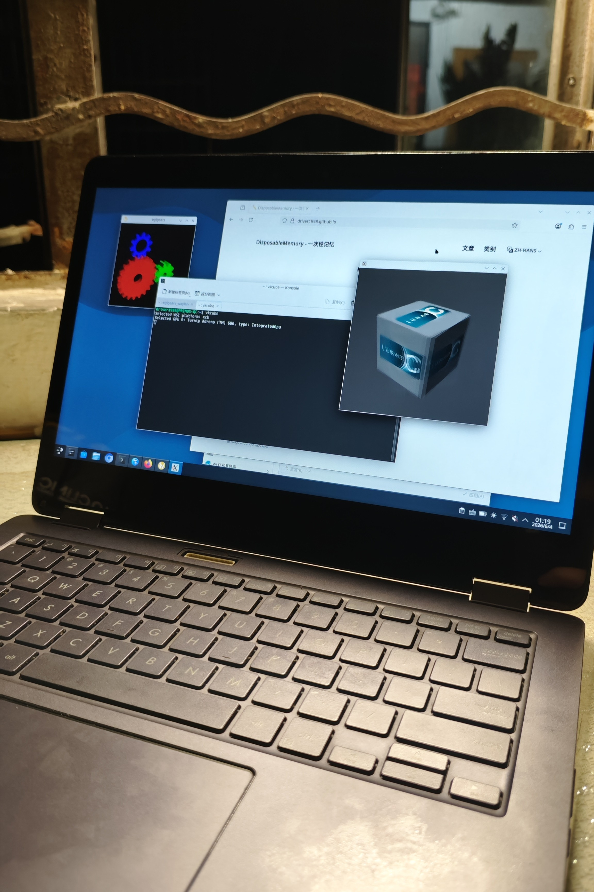
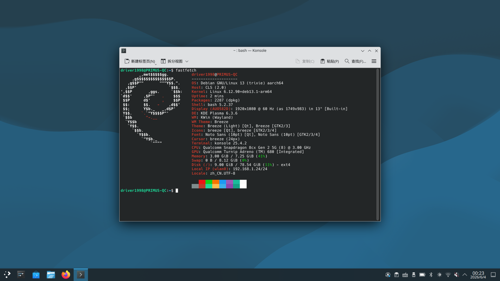
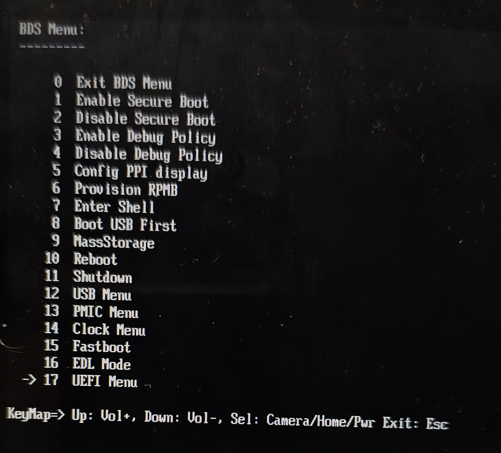
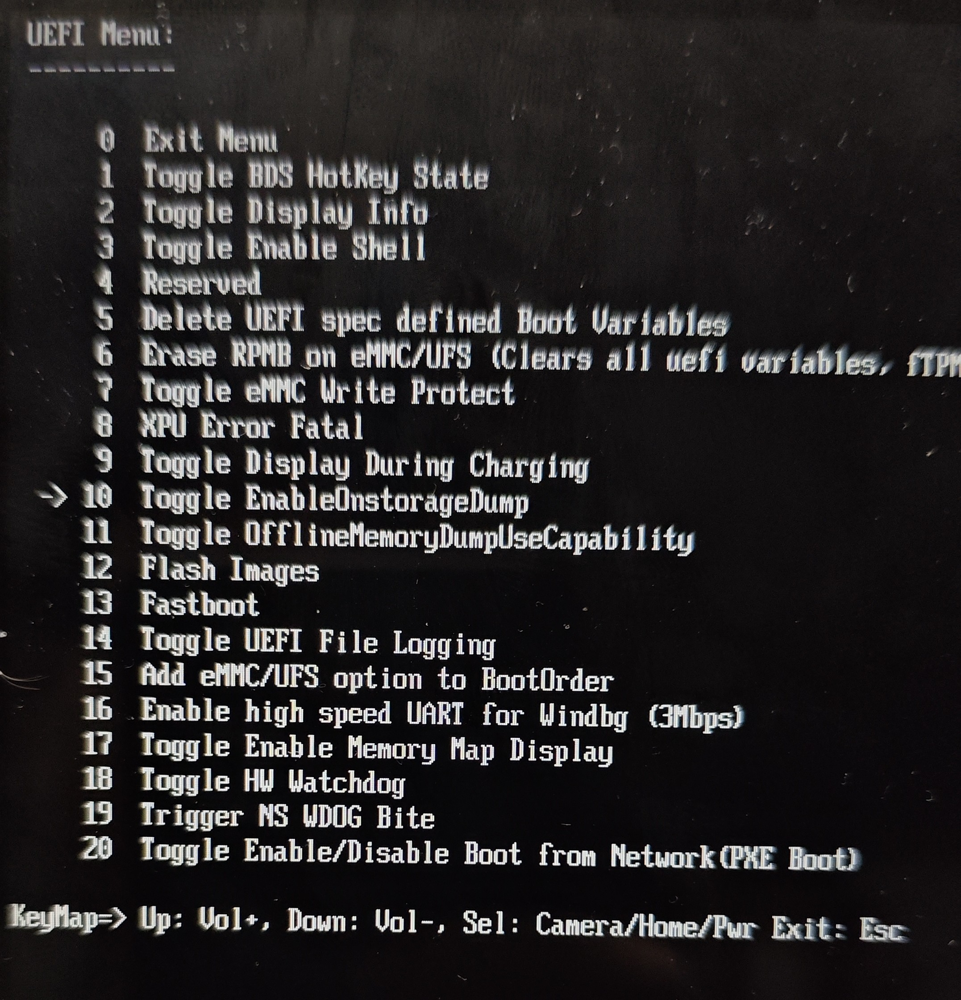
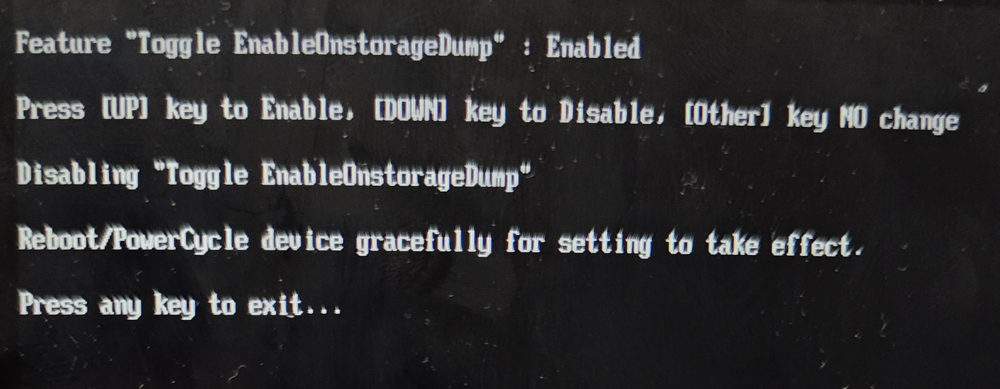
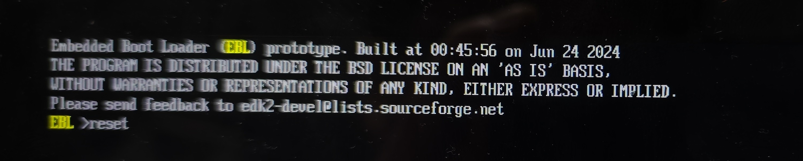

+++
title = '高通 Primus 安装 Debian 13 分享'
date = 2026-06-04T00:55:34+08:00
categories = ['高通', 'Linux', 'ARM64']
+++

我几年前买了一台高通 Primus 笔记本当玩具，这其实是高通骁龙 8cx 平台的参考设计平台，华硕代工。

作为高通参考设计，就有几个好处，其中一个是这玩意有比较完善的主线 Linux 支持 (8cx Gen 1/Gen 2 平台有主线支持的目前只有它和联想的 Yoga 5G)。

只可惜因为高通平台的特殊性（高通的笔记本平台本质上就是个大号 Windows Phone），想在这上面用 Linux 可不是一个有主线支持就能用这么简单的事情...



## 基本现状

硬件支持已经基本完善，GPU 正常、WiFi 蓝牙正常、键盘触摸板触屏甚至笔都正常，续航耗电也是合理水平。



USB-C 可以充电和数据，但视频输出不能用。

音频无驱动。

虚拟化无法工作，后面会提到。

## 提前准备

事先打个预防针：这篇文章不太适合小白（或者说 Windows ARM 设备装 Linux 这件事本来就不太适合小白，高通平台要折腾的东西太多了）

请准备一个 USB 有线网卡（一般 Linux 有驱动的即可，我用的是 AX88172），在安装过程中 WiFi 无法工作，请确保你有办法连接到网络。

请先在 Windows 上调整分区为 Linux 预留相应空间。

这台机器一般可用的有 128GB UFS 和 256GB 的 NVME SSD，且 UEFI 只能从 UFS 启动。NVME SSD 在 Windows 下可能会在开机时不识别，需要进设备管理器手动刷新才能工作，但 Linux 下无此问题。

因此可以考虑在 NVME SSD 上放根分区 /，前提是在 UFS 上单独分一个 /boot。

## 设备固件

我目前使用的是 2140 版本的固件，一般来说只要足够新即可。

WOA-Project 一直在归档高通参考设计设备的驱动包，想要更新的话直接去 https://github.com/WOA-Project/Qualcomm-Reference-Drivers/tree/master/8180_CLS 下载就行（1.0.2140.0 对应 200.0.112.0）。

不过由于高通平台驱动依赖关系过于复杂，更新驱动在这里还是一件风险蛮高的事情。我一般要更新驱动和 UEFI 固件的时候会将整个打包下载下来，用 DISM 注入到 install.wim，然后直接重装 Windows 系统... （高通的固件更新走 Capsule 更新，作为一个驱动包推送）

当然我们现在在讨论 Linux。Linux 需要这些固件 blob，它们可以从上面的归档里下载到，也可以从当前的 Windows 安装中提取：

- qcdxkmsuc8180.mbn （在 qcdx8180.cab，GPU 驱动）
- wlanmdsp.mbn （在 qcwlan8180.cab，WiFi 网卡驱动，需要将文件名改成小写）
- qcadsp8180.mbn （在 qcsubsys_ext_adsp8180.cab）
- qcmpss8180.mbn （在 qcsubsys_ext_mpss8180.cab）

除了上面所列之外的固件都可以在 `linux-firmware` 里找到，`trixie-backports` 源提供了足够新的版本（20260410）。

## 详细安装配置过程

### 启动安装

将 Debian 13 的 ISO 写入到 U 盘，然后从 https://deb.debian.org/debian/dists/trixie/main/installer-arm64/current/images/device-tree/qcom/sc8180x-primus.dtb 下载 Primus 的设备树并放到 U 盘根目录。

从 U 盘启动到 Grub，按 c 进入命令行，然后输入

```
devicetree /sc8180x-primus.dtb
```

加载设备树，然后按 ESC 返回 Grub 菜单。

选中 Install 或 Graphical install （但不要按回车！），按 e 进入编辑界面。光标移到 linux 行的最后（quiet 的位置），删除 quiet，并加入以下参数

```
pd_ignore_unused clk_ignore_unused efi=novamap modprobe.blacklist=msm,dispcc_sm8250 nomodeset
```

前三个是高通平台笔记本运行 Linux 一般需要的参数，由 Renegade Project 整理。后面是临时禁用 GPU 驱动，避免因缺失固件导致安装后黑屏。

编辑好后如下：

```
    linux    /install.a64/vmlinuz  --- pd_ignore_unused clk_ignore_unused efi=novamap modprobe.blacklist=msm,dispcc_sm8250 nomodeset
```

按 Ctrl-X 启动内核开始安装。

### 分区

千万千万不要选择自动分区！这台机器的固件在 UFS 上，虽然放在了另一个逻辑卷，跟正常系统分区隔离（所以你在 Windows 下看不到固件分区），但 Linux 下会将它们也全部列出来（作为独立的磁盘显示），请勿手贱乱动固件分区上的数据，否则设备会直接变砖！

> 这机器的 [lsblk 输出](lsblk.txt)... 洋洋洒洒五十多个分区... 😐

其余的在前面准备环节已经讲得挺清楚了。

### 第一次启动

Primus 的 efivars 工作不太正常（高通平台上 efivars 是模拟出来的，Linux 对这个的支持还不太完善），所以安装时写入的 EFI 启动项不一定能生效。必要时请进入 EFI Shell （音量上 + 开机键进入 BDS Menu，然后选择 Enter Shell）手动运行 /efi/debian/grubaa64.efi。

进入 Grub 之后，一样按 c 进命令行加载 devicetree

如果你将 rootfs 放 UFS 上，那应该能直接在 Grub 上加载到（下面的 {xxx} 为你所使用的内核小版本，可以用 Tab 补全）

```
devicetree /lib/linux-image-6.12.{xxx}/qcom/sc8180x-primus.dtb
```

如果你跟我一样将 rootfs 放 NVME 上... 那你只能暂时从 U 盘加载设备树了。用补全先确认 U 盘是什么设备名（`devicetree (hd` 然后按tab），然后再继续补全整个加载命令，比如：

```
devicetree (hd6,msdos1)/sc8180x-primus.dtb
```

加载完之后 ESC 回到菜单。Debian 安装时会将安装盘内核接收到的额外参数填到安装后的 Grub 参数里，所以这里直接选 Debian 回车即可进入系统。

接下来我们开始修各种大小问题。

### Grub 自动加载设备树及 EFI 启动项

首先将 dtb 复制到 /boot/efi （也就是 ESP），然后修改 /boot/efi/EFI/debian/grub.cfg，在最前面加上一行 `devicetree /sc8180x-primus.dtb`，这样每次进入 Grub 都会自动加载设备树了。

未来内核更新时，也建议复制新内核的设备树（如上所述，在 `/lib/linux-image-6.12.{xxx}/qcom/sc8180x-primus.dtb`） 到 ESP 下。

放在 ESP 而不是 /boot/grub/grub.cfg 是因为 ESP 下的 grub.cfg 除了 grub-install 别的情况下都不会被修改，一般不用担心改动被覆盖的问题。

至于 EFI 启动项，请在 Windows 下用 BOOTICE 之类的工具手动添加（x64 的 BOOTICE 可以正常工作）。

### GPU

注意：在进行以下操作之前先连上网，安装 SSH 服务并确定能正常连接上！因为一旦有问题，启动 GPU 内核模块会立即黑屏。有 SSH 访问可以方便排查问题。

将以下固件文件放入 /lib/firmware/qcom/sc8180x (不存在的目录请自行创建)

- qcdxkmsuc8180.mbn

并且从 `trixie-backports` 源安装 `firmware-qcom-soc` 包，补充其他需要的固件 blob。

最后运行 `sudo update-initramfs -u` 重新生成 initramfs。

重启，在 Grub 下尝试去掉 ` modprobe.blacklist=msm,dispcc_sm8250 video=efifb` 这几个内核参数启动。

如果没问题的话就可以修改 `/etc/default/grub` 将 `GRUB_CMDLINE_LINUX_DEFAULT` 中的 ` modprobe.blacklist=msm,dispcc_sm8250 video=efifb` 去掉了。去掉之后别忘了执行 `sudo update-grub` 更新 Grub 菜单。

### WiFi & 蓝牙

将以下固件文件放入 /lib/firmware/qcom/sc8180x

- qcadsp8180.mbn
- qcmpss8180.mbn
- wlanmdsp.mbn

运行 `sudo update-initramfs -u` 重新生成 initramfs。

并安装以下软件包：

```
sudo apt install qrtr-tools tqftpserv rmtfs
```
并且从 `trixie-backports` 源安装 `firmware-atheros` 包，补充其他需要的固件 blob。

然后重启，WiFi 应该就可以正常工作了。但因为目前驱动无法获取 MAC，每次开机时 WiFi MAC 地址都会随机生成。由于同样的原因，蓝牙无法工作。

可以通过创建 udev 规则给 WiFi 和蓝牙固定 MAC 地址。

创建 udev rule `/etc/udev/rules.d/99-fix_mac_addresses.rules`，内容如下：

```
ACTION=="add", SUBSYSTEM=="net", ENV{DEVPATH}=="/devices/platform/soc@0/18800000.wifi/*", \
  RUN+="/usr/bin/ip link set dev %k address XX:XX:XX:XX:XX:XX"
ACTION=="add", SUBSYSTEM=="bluetooth", ENV{DEVTYPE}=="host" \
  ENV{DEVPATH}=="*/serial[0-9]*/serial[0-9]*/bluetooth/hci[0-9]*", \
  TAG+="systemd", ENV{SYSTEMD_WANTS}="hci-btaddress@%k.service"
```

上面第一部分是给 WiFi 的，将 `XX:XX:XX:XX:XX:XX` 改为一个合法的 MAC 地址，可以在 Windows 下查询得到。

第二部分是给蓝牙的，调用一个 systemd 服务更新蓝牙 MAC 地址。所以我们需要创建该服务 `/lib/systemd/system/hci-btaddress@.service`，内容如下：

```
[Unit]
Description=HCI bluetooth address fix

[Service]
Type=simple
ExecStart=/bin/sh -c 'sleep 5 && yes | btmgmt -i %I public-addr XX:XX:XX:XX:XX:XX'
```

将 `XX:XX:XX:XX:XX:XX` 改为一个合法的蓝牙 MAC 地址，同样可以在 Windows 下查询得到。

运行 `systemctl daemon-reload` 更新，然后重启，WiFi 和蓝牙应该都可以正常工作。

## 虚拟化

高通 Windows ARM 设备运行 Linux 需要使用 slbounce 向固件获取 EL2 权限才能使用虚拟化。可惜目前 slbounce 在 Primus 下会导致固件崩溃（进 Qualcomm Crashdump Mode），所以暂时不可用。

需要使用虚拟化的话可以考虑在 Windows 上使用 Hyper-V，以及基于 Windows Hypervisor Platform 的 VirtualBox 7.2.x 和 QEMU 11.x。

## Qualcomm Crashdump Mode

上面提到了 Qualcomm Crashdump Mode，虽然设备提供了这个模式可以在系统/固件崩溃时获取 dump，但目前并没有公开的工具可以提取或解析这些 dump。所以可以考虑禁用崩溃时进入 Crashdump Mode，让机器在崩溃时自动重启（不然每次都得长按电源键重启也挺烦的）。

关机状态下按 音量上 + 电源 进入 BDS MENU，进入 UEFI Menu -> Toggle EnableOnstorageDump。



然后按上方向键将配置改为 Enable。


一路 ESC 退出到 EBL 命令行，输入 reset 重启即可。


> 从描述来看应该是让设备将 dump 写到磁盘上然后自动重启，不知道写在什么地方呢？

## 参考资料
- https://wiki.debian.org/InstallingDebianOn/Thinkpad/X13s
- https://github.com/edk2-porting/renegade-project.org/blob/master/zh/linux/cmdline.md
- https://github.com/aarch64-laptops/build/tree/master/misc/lenovo-yoga-c630/wifi
- https://github.com/WOA-Project/Qualcomm-Reference-Drivers/
