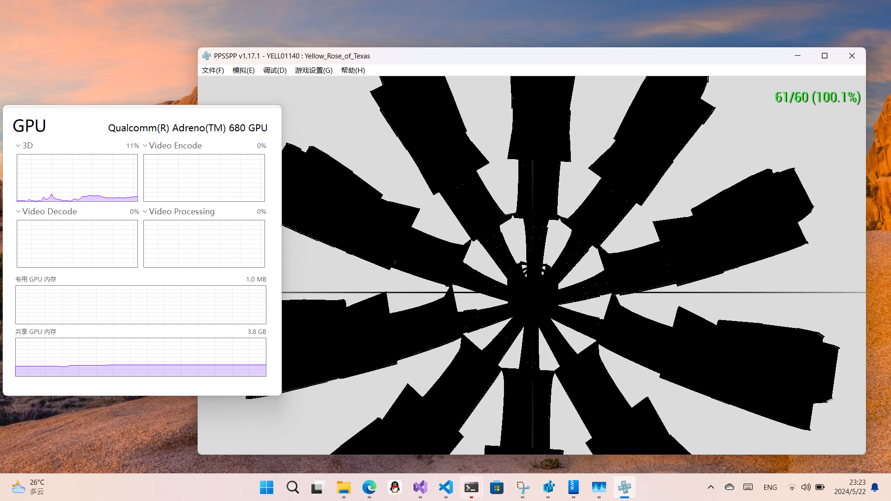
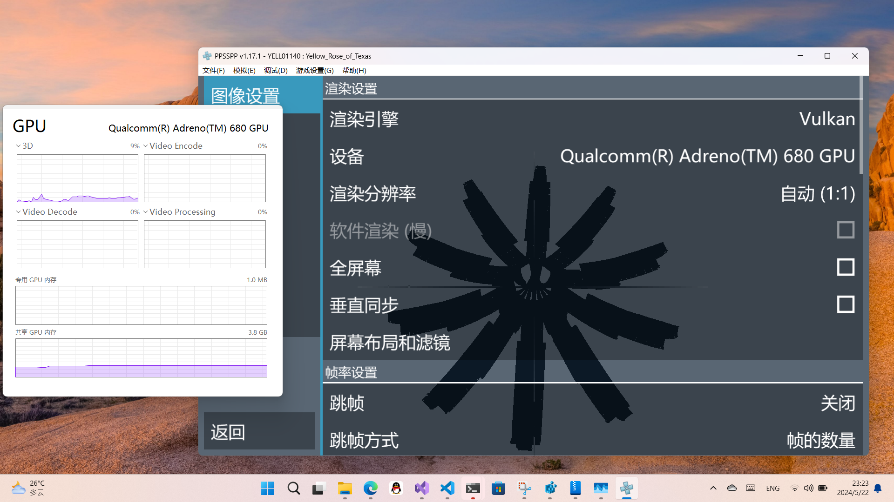

+++
title = 'Native Vulkan on Snapdragon 8cx'
date = 2024-05-23T00:22:48+08:00
categories = ['Windows', 'ARM64', '.NET']
+++


Snapdragon X series is finally out, and the GPU driver for the new platform finally includes native support for the Vulkan API.

Interestingly, this Vulkan driver can be directly ported to older platforms like the 8cx. Let's talk about how.

The follow method does not require editing driver files, or disabling Secure Boot / Driver signing requirement.

## Warning

If you can use the Vulkan compability pack from Microsoft (based on the Vulkan to DirectX 12 translation layer dozen in Mesa), use it. Forcing the Snapdragon X Vulkan driver on old devices is pretty unstable, especially when the Vulkan window is in the background.

Of course that compability pack only works on 8cx Gen 3, if you are stuck with Gen 2 as I do, keep reading.

## Download the Snapdragon X GPU Driver

First, we need the GPU driver for Snapdragon X. Luckily [WOA Project](https://github.com/WOA-Project) maintains a set of driver packs for various Qualcomm SoCs, these drivers come from Qualcomm reference devices.

Drivers for Snapdragon X are at https://github.com/WOA-Project/Qualcomm-Reference-Drivers/tree/master/8380_CRD .

There are many versions under that path, pick the latest on e(200.0.18.0 at the time of writing), then download `qcdx8380.cab` inside. 

## Extract the necessary files

Extract the cab archive, then copy the following files to a separate directory (like `C:\qcvk`):

```
adreno_utils.dll
libgsluser.dll
qcgpuarm64xcompilercore.DLL
qcvkarm64xcompiler.dll
qcvkarm64xum.dll
qcvk_icd_arm64x.json
```

## Register the Vulkan ICD

Locate to `HKEY_LOCAL_MACHINE\SOFTWARE\Khronos\Vulkan\Drivers` in the registry (create these keys if you can't find them) and create a DWORD here, name it the full path of `qcvk_icd_arm64x.json` (like `C:\qcvk\qcvk_icd_arm64x.json`) and set the value as 0.


## Get Vulkan Loader

If you are running 24H2 (26100), it should have Vulkan Loader built in at `C:\Windows\system32\vulkan-1.dll`, and you can skip this.

Vulkan programs loads Vulkan drivers via the Vulkan Loader, if you want to run x64 Vulkan apps, simply download and install Vulkan Runtime from LunarG.

But LunarG currently does not have ARM64 binaries of Vulkan Loader available. For now, you can:

- Compile it yourself with the source at https://github.com/KhronosGroup/Vulkan-Loader

- Use binaries from MSYS2: https://packages.msys2.org/package/mingw-w64-clang-aarch64-vulkan-loader?repo=clangarm64 \
Download with the link listed as "File", extract the package with 7-zip, and get `vulkan-1.dll` from `clangarm64/bin`

You should place `vulkan-1.dll` next to your Vulkan app exe. Do not put it in `system32` to avoid conflicts with the x64 one from LunarG Vulkan Runtime.

## Enjoy!

Really, that's it.

Now you should be able to run programs that uses Vulkan. Here is some screenshots of the Yellow Rose of Texas running on ARM64 PPSSPP with Vulkan on 8cx Gen 2.





## Credits

Proof of concept by [Gustave Monce (gus33000)](https://github.com/gus33000), who ported this to Snapdragon 855 phones.